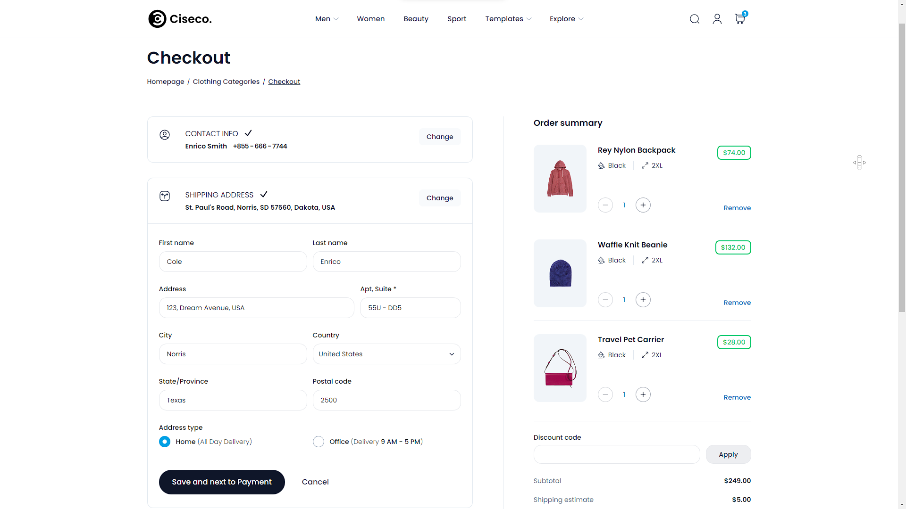
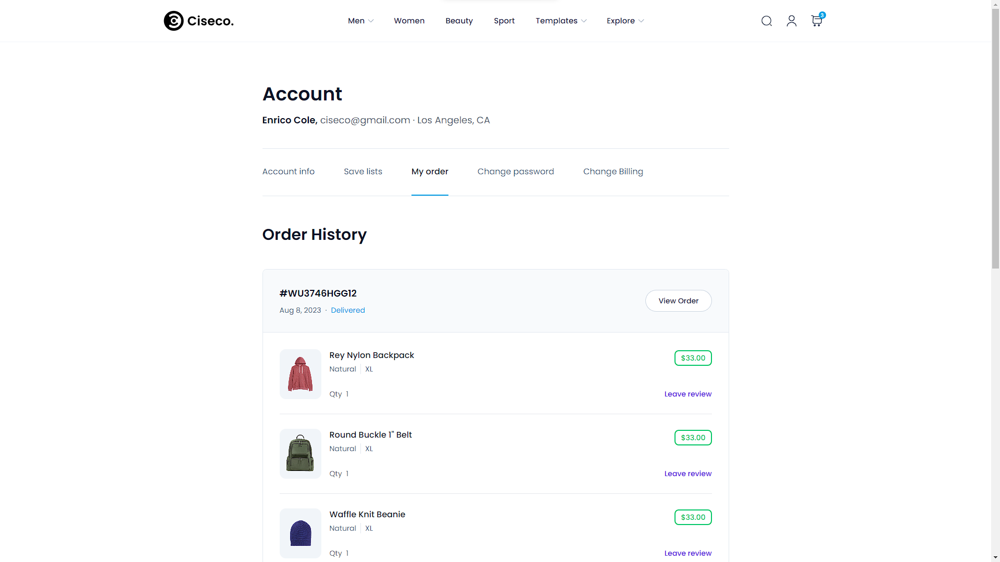

# Ciseco E-Commerce

An eco shop & ecommerce responsive React template built by React.JS & Tailwind CSS

## Screenshots





## Technologies

| Client                | Server                    |
| --------------------- | ------------------------- |
| React.JS              | Bcrypt.JS                 |
| Headless UI           | Cloudinary.JS             |
| React Redux           | Colors.JS                 |
| Redux Toolkit         | Cors Policy               |
| Tailwind CSS          | Dotenv                    |
| Tailwind Forms        | Express.JS                |
| Tailwind Line Clamp   | JWT                       |
| Tailwind Typography   | Mongoose.JS               |
| Tailwind Aspect Ratio | Multer.JS                 |
| React.JS              | Multer Storage Cloudinary |
| React Router Dom      | Nodemailer                |
| ❌                    | Validator.JS              |

## Important Links

- Client Side Live Link: [Click Here]()

- Server Side Live Link: [Click Here]()

- Dashboard Reference Link: [Click Here](https://loopinfosol.in/themeforest/ekka-html-v33/ekka-admin/index.html)

- Reference Site Live Link: [Click Here](https://chisnghiax.com/ciseco/)

# Make it own

```bash
git clone https://github.com/hasibulislam999/9T5--ciseco-ecommerce.git
cd 9T5--ciseco-ecommerce
code .
yarn install
```
